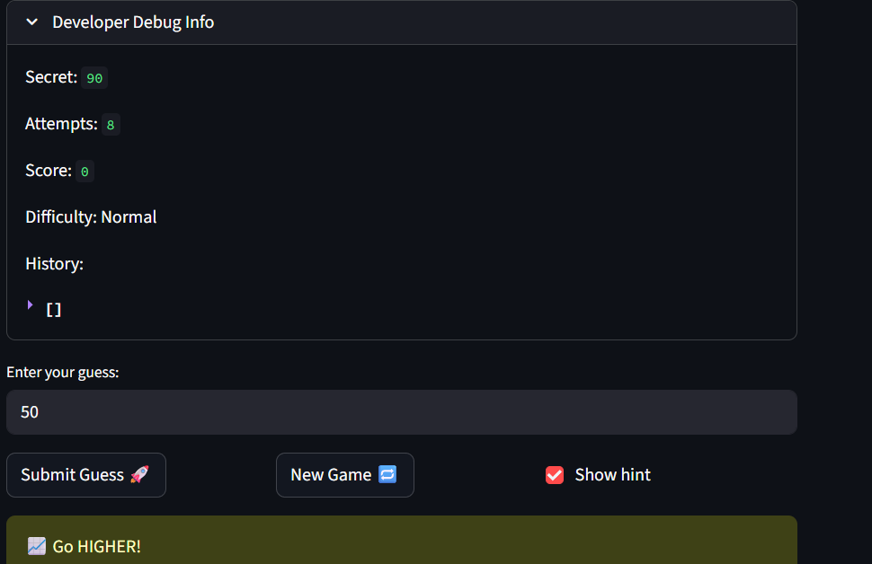
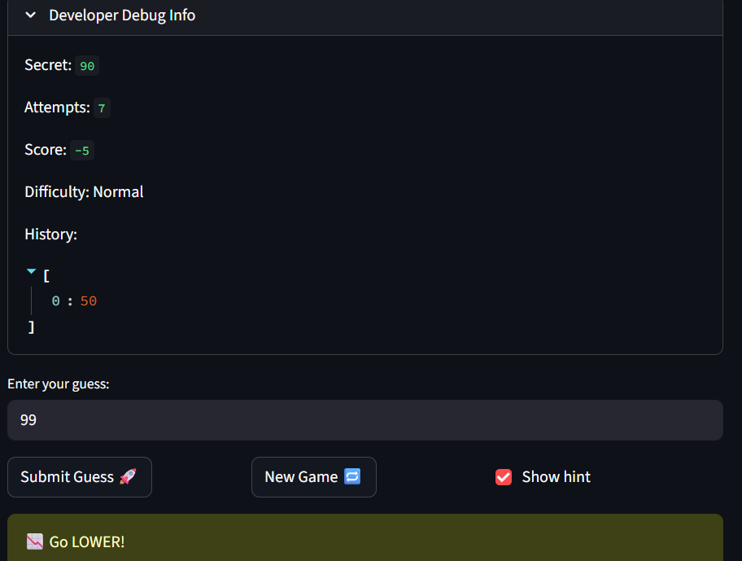
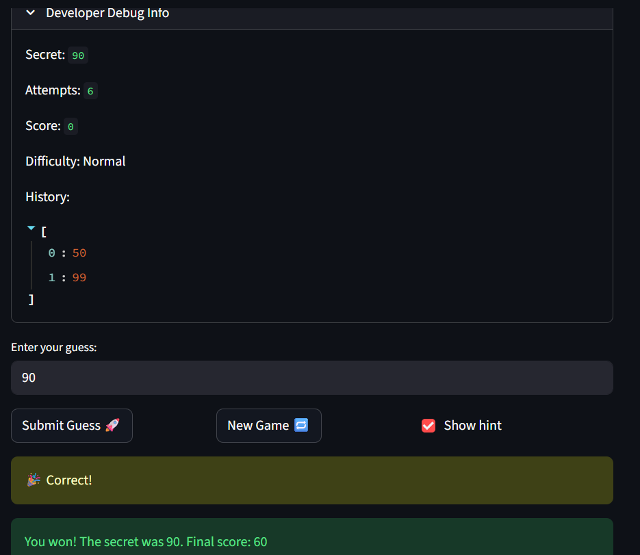
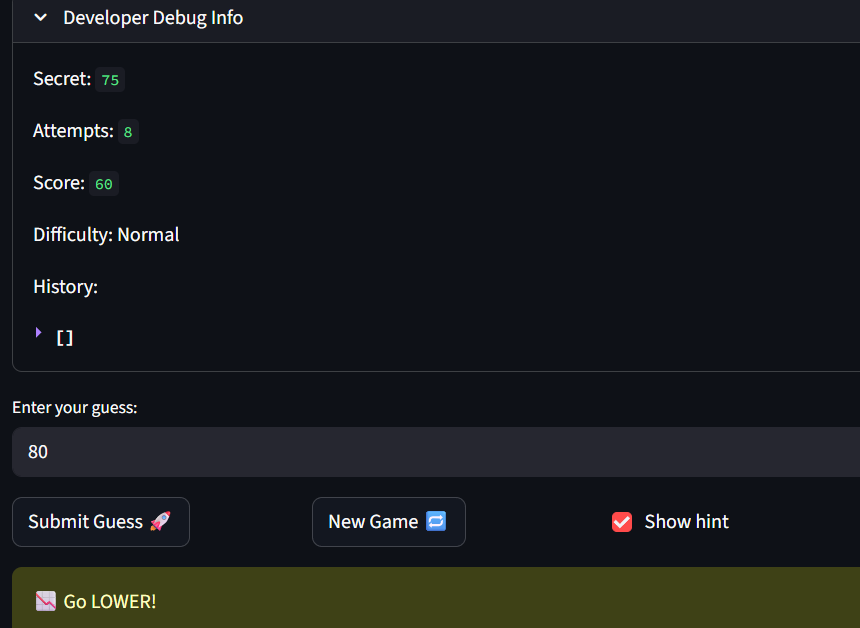

# 🎮 Game Glitch Investigator: The Impossible Guesser

## 🚨 The Situation

You asked an AI to build a simple "Number Guessing Game" using Streamlit.
It wrote the code, ran away, and now the game is unplayable. 

- You can't win.
- The hints lie to you.
- The secret number seems to have commitment issues.

## 🛠️ Setup

1. Install dependencies: `pip install -r requirements.txt`
2. Run the broken app: `python -m streamlit run app.py`

## 🕵️‍♂️ Your Mission

1. **Play the game.** Open the "Developer Debug Info" tab in the app to see the secret number. Try to win.
2. **Find the State Bug.** Why does the secret number change every time you click "Submit"? Ask ChatGPT: *"How do I keep a variable from resetting in Streamlit when I click a button?"*
3. **Fix the Logic.** The hints ("Higher/Lower") are wrong. Fix them.
4. **Refactor & Test.** - Move the logic into `logic_utils.py`.
   - Run `pytest` in your terminal.
   - Keep fixing until all tests pass!

## 📝 Document Your Experience

*- [ ] Describe the game's purpose.*
The game is supposed to check whether the user successfully guessed the secret number and also keep track of how many attempts it took and the score (points earned).

*- [ ] Detail which bugs you found.*
I found that the message shown to the user was wrong. When the guess was less than the secret number, it said to enter lower number. Same thing happened when the guess was higher than the secret number.
Another bug was that the history and number of attempts were not reset after the user clicks on "New Game".

*- [ ] Explain what fixes you applied.*
I used AI as a collaborator to help me fix both bugs. I asked it refactor the check_guess function and the new game logic. For the 1st bug, AI did it correctly. But for the 2nd bug, the AI was wrong. So, I checked the code it suggested and asked it to make the specific changes I noticed. This is detailedly mentioned in the reflection.md file.

## 📸 Demo

- [ ] 
Check_Guess Function Logic:
---
   
   
   

Reset Game Logic:
---
   

## 🚀 Stretch Features

- [ ] [If you choose to complete Challenge 4, insert a screenshot of your Enhanced Game UI here]
